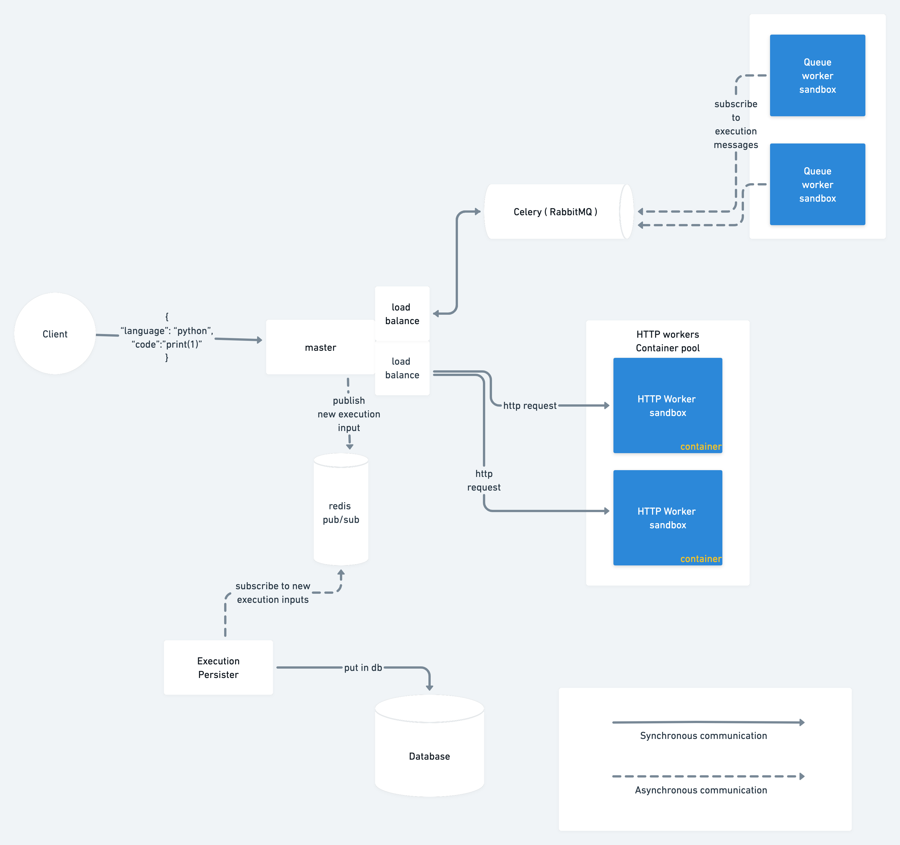

# Remote code execution
Have you ever wondered:
- how some web apps like: "hackerrank", "algoexpert", "leetcode" and others  execute the code you write on the client side?
- How these web apps compile and run unknown code without any security threats? 
- How they manage to deal with dozens of different languages and their version in a scalable manner?

"Remote code execution engine" - project is an API, which allows you to run code passed via HTTP request to a server in 
a secure sandbox environment of active docker containers.

So if you want to have an API where you will send your code for execution and results check this project out.

# System Supported languages
This is a list of languages current API can execute and work with:
- python

# Architecture
